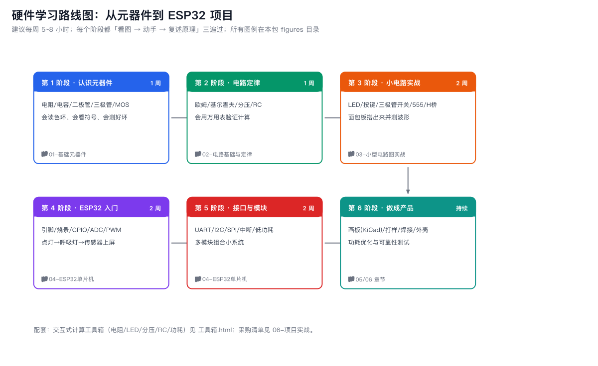

# 00 学习路线图

## 六阶段总览

| 阶段 | 主题 | 建议时长 | 完成标志（自查） |
|---|---|---|---|
| 1 | 认识元器件 | 1 周 | 给我一只元件，能说出类别、关键参数、典型用途；能读色环 |
| 2 | 电路定律 | 1 周 | 给定电路能算出各点电压电流，并用万用表实测验证误差 <10% |
| 3 | 小电路实战 | 2 周 | 能在面包板上独立搭出 LED 驱动、三极管开关、555 闪烁、H 桥调速 |
| 4 | ESP32 入门 | 2 周 | 能烧录程序，用 GPIO/ADC/PWM 完成「传感器读数上屏」 |
| 5 | 接口与模块 | 2 周 | 能组合 ≥3 个模块（显示+传感+执行），并让设备深度睡眠省电 |
| 6 | 做成产品 | 持续 | 用 KiCad 画板、打样、焊接、装壳，稳定运行 ≥7 天 |

## 每周节奏建议

- **看图 30%**：读本章图例，合上书能复述符号含义与关键公式。
- **动手 50%**：面包板/开发板实操，拍照记录接线。
- **输出 20%**：用自己的话写 3~5 行笔记（写不出=没懂）。

## 器材准备（先买这些就够）

见 [06-项目实战/02-采购清单与预算.md](06-项目实战/02-采购清单与预算.md)。最低配置约 ¥150：
ESP32 开发板 ×1、面包板 ×1、杜邦线一包、电阻电容包、LED 包、按键、万用表（可后补）、USB 线。

## 学习方法三条军规

1. **永远先算再搭**：限流电阻、分压比先手算，搭完用万用表验证。算与测对不上，就是学习发生的地方。
2. **一次只改一个变量**：电路不工作时，只动一处再测，避免「乱调碰运气」。
3. **烧了不丢人，记录才值钱**：把每次烧元件的原因写进笔记，三个月后它就是你的经验库。
