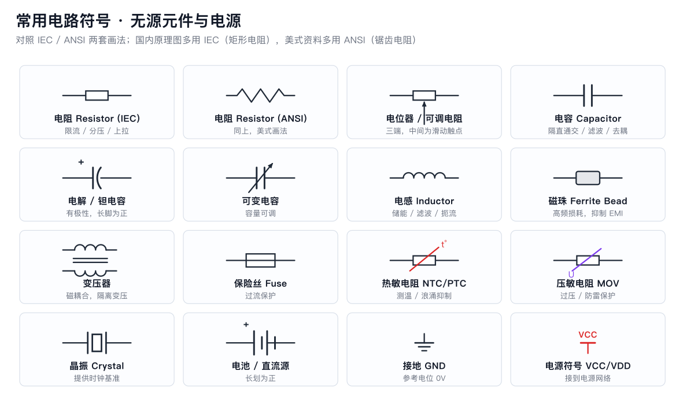
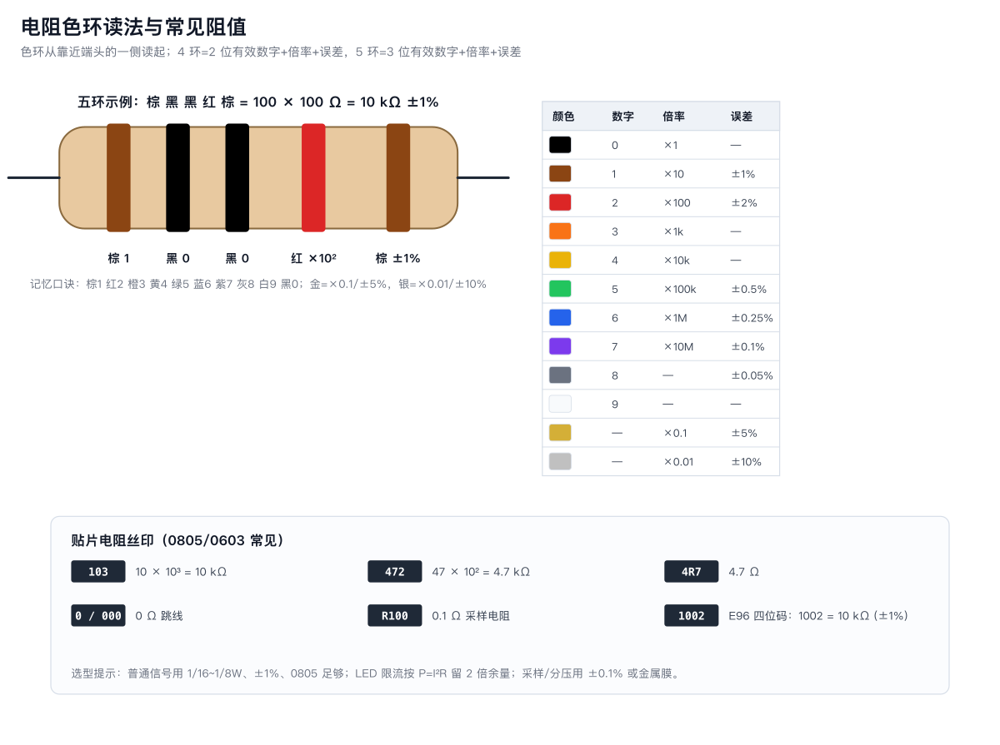

# 01 电阻 Resistor

**一句话**：电阻限制电流、分配电压，是电路里数量最多的元件。

## 1. 它做什么

- **限流**：保护 LED、限制三极管基极电流。`I = U / R`
- **分压**：两只电阻串联，把高电压按比例降低（见 [分压电路](../02-电路基础与定律/02-串并联-基尔霍夫-分压分流.md)）。
- **上拉/下拉**：给引脚一个确定的默认电平（ESP32 内部已有，外部常加 10k）。
- **采样**：小阻值（0.1Ω）把电流变成电压供 ADC 测量。
- **匹配/阻尼**：串口串 22~100Ω 抑制振铃；LED 数据线串 330Ω。

## 2. 关键参数

| 参数 | 含义 | 新手要点 |
|---|---|---|
| 阻值 | Ω / kΩ / MΩ | 常用 E24 系列：1.0, 1.2, 1.5, 2.2, 3.3, 4.7, 6.8… |
| 功率 | P = I²R = U²/R | 信号级 1/16~1/8W 足够；留 2 倍余量 |
| 精度 | ±1% / ±5% | 分压、采样用 ±1% 或 ±0.1% |
| 封装 | 直插 / 0402/0603/0805 | 手焊选 0805 或直插 |
| 温度系数 | ppm/°C | 精密测量才关心 |

## 3. 读色环与贴片丝印

- 4 环：2 位有效数字 + 倍率 + 误差。例：**棕黑红金 = 1 0 ×100 = 1kΩ ±5%**
- 5 环：3 位有效数字 + 倍率 + 误差。例：**棕黑黑红棕 = 100 ×100 = 10kΩ ±1%**
- 贴片丝印：`103`=10k、`472`=4.7k、`4R7`=4.7Ω、`R100`=0.1Ω、四位码 `1002`=10k(1%)。

> 读环方向：从靠近端头的一环读起；误差环（金/银）通常离得稍远。

## 4. 选型速查

| 场景 | 推荐 |
|---|---|
| LED 限流（3.3V/红） | 68~100Ω, 1/8W |
| LED 限流（5V/红） | 220~330Ω |
| 按键上拉/下拉 | 10kΩ |
| I2C 上拉 | 4.7kΩ（模块常自带） |
| 三极管基极 | 330Ω~1kΩ |
| ADC 分压 | 10k+10k 或 30k+10k, ±1% |
| 电流采样 | 0.1Ω 1W 金属膜 |

## 5. 常见坑

1. **功率不够**：12V 经 100Ω 到地，P=1.44W，1/8W 电阻会冒烟。
2. **把可调电阻当固定电阻用**：滑动端悬空时阻值不定。
3. **忽略自身功耗**：电池供电的分压电路，阻值太小会偷偷耗电（10k+10k 接 3.3V 常耗 0.55mA）。
4. **色环读反**：拿不准就用万用表量，量是最快的老师。

## 6. 动手验证（10 分钟）

1. 从电阻包挑 3 只，先读色环记录标称值。
2. 万用表电阻档实测，计算误差。
3. 把 1kΩ 接 3.3V，测两端电压与电流，验证 `I=U/R`。
