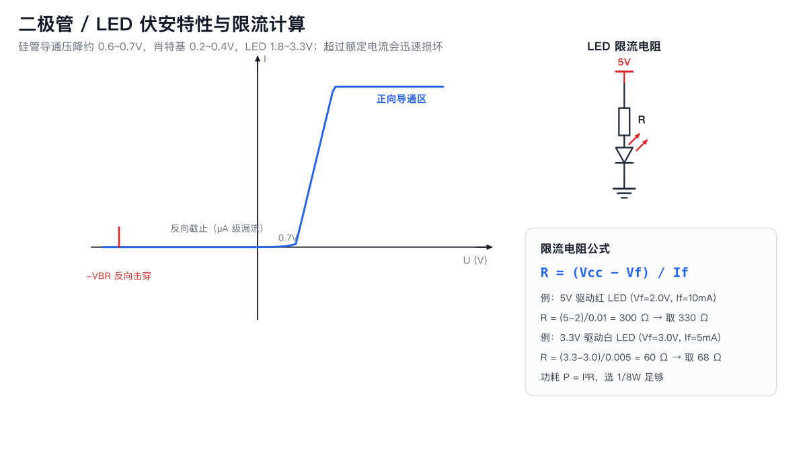
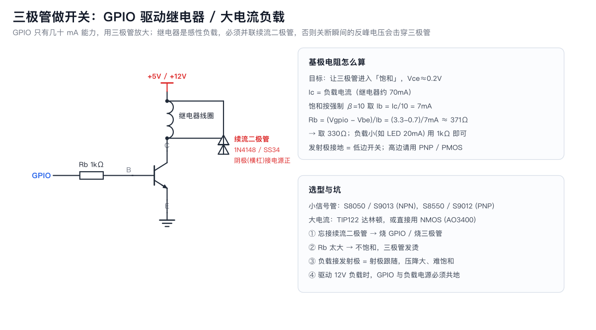

# 04 二极管与 LED

**一句话**：二极管只让电流单方向通过；LED 是会发光的二极管，但必须限流。

## 1. 核心特性

- **正向导通压降 Vf**：硅 0.6~0.7V，肖特基 0.2~0.4V，LED 1.8~3.3V。
- **反向截止**：只有 µA 级漏流；超过反向击穿电压 VBR 会损坏（稳压管例外，它工作在反向击穿区）。
- **单向性记忆**：符号箭头方向 = 允许电流方向；横杠 = 阴极（负极，色环/缺口标记）。

## 2. 家族成员

| 类型 | 特点 | 典型用途 |
|---|---|---|
| 整流二极管 1N4007 | 1A/1000V，慢 | 交流整流、防反接 |
| 肖特基 SS34/SS14 | 低压降、快 | 续流、DC-DC、防反接低功耗 |
| 稳压管 Zener | 反向击穿稳压 | 简易基准、过压钳位 |
| TVS | 瞬态吸收 ns 级 | 接口防静电/浪涌 |
| LED | 发光 | 指示、照明、WS2812 |
| 光电二极管/光耦 | 光→电 / 隔离 | 传感、隔离通信 |

## 3. LED 限流计算（必会）

`R = (Vcc − Vf) / If`

| 电源 | LED | Vf | If | R 计算 | 取值 |
|---|---|---|---|---|---|
| 3.3V | 红 | 2.0V | 5mA | (3.3−2)/0.005=260Ω | 270~330Ω |
| 3.3V | 白/蓝 | 3.0V | 5mA | (3.3−3)/0.005=60Ω | 68~100Ω |
| 5V | 红 | 2.0V | 10mA | (5−2)/0.01=300Ω | 330Ω |
| 12V | 白 | 3.0V | 10mA | (12−3)/0.01=900Ω | 1kΩ |

> 亮度与电流非线性：5mA 已足够亮，别为「更亮」把电流推到 20mA 以上（普通 LED 极限）。

## 4. 续流二极管（感性负载必备）

继电器、电机、电磁阀线圈在关断瞬间会产生几十~几百伏反峰。
**并联一只二极管（阴极接电源正）**，给线圈电流提供泄放回路：

选型：电流 ≥ 负载电流，耐压 ≥ 2×电源电压；速度要求高用肖特基/快恢复。

## 5. 防反接的两种做法

1. **串二极管**：简单，但损失 0.3~0.7V 压降与功率（肖特基更好）。
2. **串 PMOS/保险丝+TVS**：低损耗，适合电池产品。

## 6. 常见坑

1. **LED 不限流**：直接接 3.3V 会过流烧毁或寿命骤减。
2. **极性接反不亮**：长脚/大电极片为负（直插 LED 切边侧为负）。
3. **用整流管做高频续流**：1N4007 反向恢复慢，开关电源里会发烫，换 SS34。
4. **稳压管当电源用**：效率低、负载能力差，只适合 µA~mA 级基准。
5. **TVS 方向接反**：单向 TVS 有极性。

## 7. 动手验证

1. 万用表二极管档：红笔接阳极显示 Vf（硅≈0.6），反接显示 OL。
2. 搭 LED+330Ω 接 3.3V，测 LED 两端电压验证 Vf，测电阻两端电压算电流。
