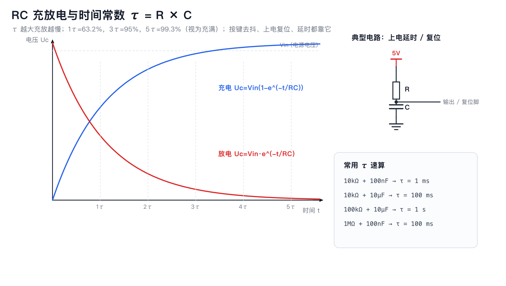
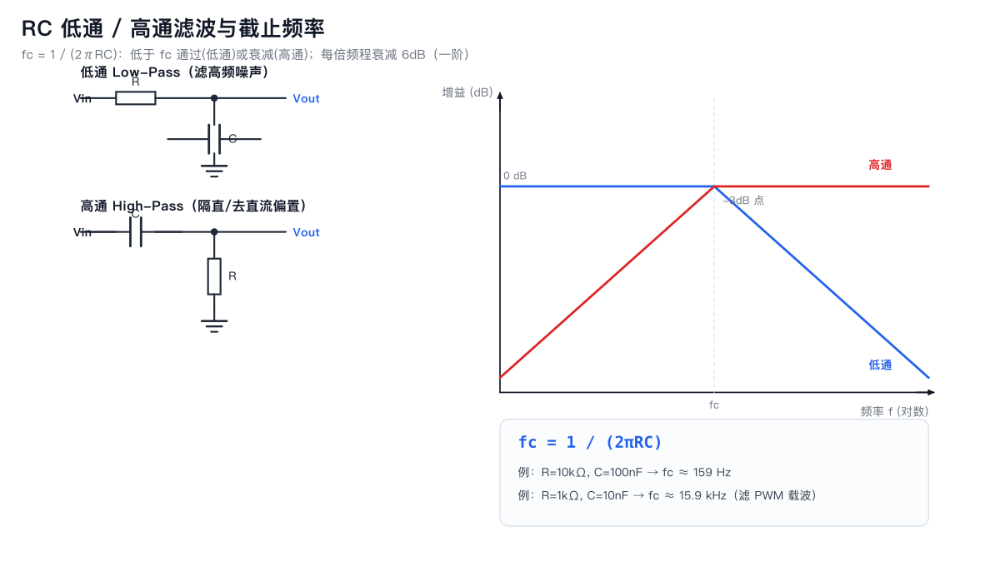

# 03 RC 电路与滤波

**一句话**：R 与 C 组合产生「时间」与「频率选择」，是模拟电路的第一课。

## 1. 时间常数 τ = RC

- 充电：`Uc = Vin × (1 − e^(−t/RC))`；放电：`Uc = Vin × e^(−t/RC)`
- 1τ=63.2%，3τ=95%，5τ=99.3%。

| 应用 | 设计思路 |
|---|---|
| 上电复位延时 | RC 让 EN/RESET 脚缓慢升高，避开电源爬升 |
| 按键去抖 | 10k+100nF（τ=1ms）吸收抖动毛刺 |
| 软启动/渐亮 | 大 RC 驱动三极管基极 |
| 555 定时 | RA/RB/C 决定频率 |

## 2. 一阶低通 / 高通

`fc = 1 / (2πRC)`

- **低通**（R 串、C 并地）：低于 fc 通过；滤高频噪声、把 PWM 变模拟电压。
- **高通**（C 串、R 并地）：隔直流、传交流（音频耦合）。
- 一阶滚降 6dB/倍频程；要更陡用二阶（两级 RC 或运放有源滤波）。

**例题**：ESP32 LEDC 输出 5kHz PWM，想变成平滑模拟电压：
取 fc ≈ 50Hz → R=10k 时 C = 1/(2π×10k×50) ≈ 318nF → 用 330nF。

## 3. 去耦也是滤波

电源入口：大电容滤低频 + 小陶瓷滤高频；芯片脚：100nF 就近。
本质都是「给噪声一条低阻抗的回地路径」。

## 4. 常见坑

1. 用 Y5V 电容做定时/滤波：容量随电压漂移，fc 不准。
2. 两级 RC 直接 cascaded 会互相加载：第二级输入阻抗要 ≥10× 第一级输出阻抗。
3. 滤得太狠：信号带宽不足，波形失真/响应慢。
4. 忽略源阻抗：信号源内阻会叠加进 R，改变 fc。

## 5. 动手验证

1. 10k+100nF 低通，输入 5kHz 方波（ESP32 PWM），示波器/逻辑分析仪看输出三角波幅度；改 50Hz 看是否变平。
2. 10k+10µF 接按键到地，观察复位/输入脚波形是否干净。
