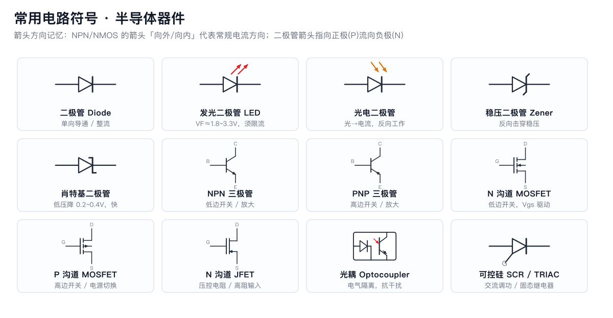
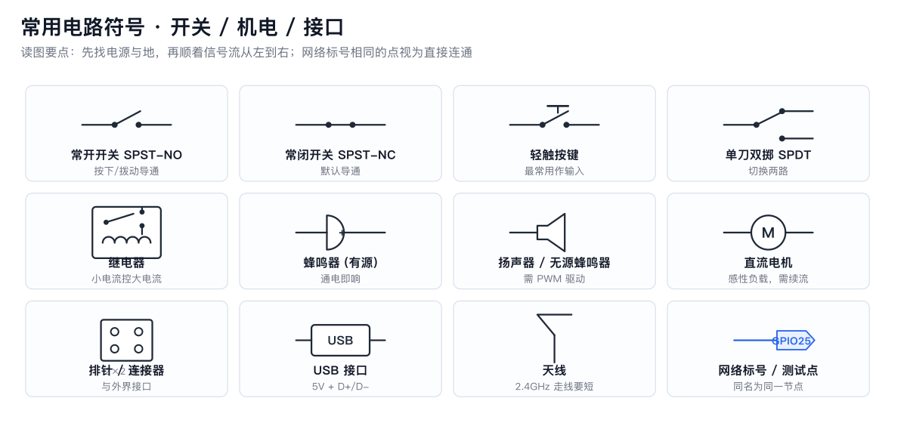

# 01 如何读懂一张原理图

**一句话**：原理图是「电气连接」的地图，不是「物理位置」的照片；先找电源与地，再顺信号流读。

## 1. 读图五步法

1. **找电源与地**：VCC/3V3/5V 符号、GND 符号、电源入口（USB/电池/端子）。
2. **看框图划分**：电源区、MCU 区、接口区、驱动区；大项目先读框图再读细节。
3. **顺信号流**：输入(传感器/按键) → 处理(MCU) → 输出(显示/驱动)。
4. **认网络标号**：同名标号 = 同一根线（如 `SDA`、`NET1`），跨页也相连。
5. **查关键值**：电阻电容的数值决定行为（限流、上拉、滤波、定时）。

## 2. 符号速查

## 3. 图纸上的「暗语」

| 记号 | 含义 |
|---|---|
| 实心圆点 | 导线连接 |
| 十字交叉无圆点 | 不连接（跨线） |
| `NC` | 不焊接/不连接 |
| `DNP`/`NF`/`*` | 预留不贴 |
| `0Ω` | 跳线/可选配置 |
| `TP1` | 测试点 |
| `104` | 100nF 电容（前两位+0 的个数 pF） |
| `4.7k` 旁 `1%` | 精度要求 |
| 引脚旁 `I/O/OD/5V-tol` | 引脚属性 |

## 4. 从原理图到实物

- 原理图 ≠ 布局：同一网络在板上的走线可能绕很远。
- 看 PCB 时配合**网络表/飞线图**（KiCad 的 ratsnest）。
- 维修时：原理图 + 万用表通断档 = 最强组合。

## 5. 练习（自测）

拿 [十个必会小电路](02-十个必会小电路.md) 中任一张图，回答：
1. 电源从哪进、经过哪些器件到地？
2. 信号从哪进、到哪出？
3. 每只电阻/电容的作用是什么？去掉会怎样？
