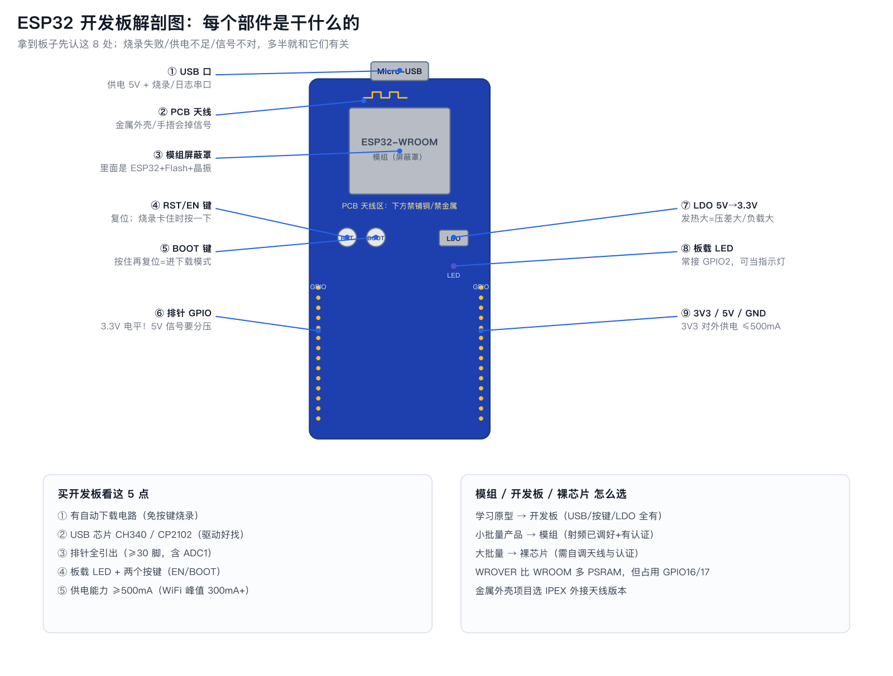

# 01 认识 ESP32 家族

**一句话**：ESP32 是乐鑫(Espressif)的 Wi-Fi+蓝牙 MCU 系列；入门买「ESP32 或 ESP32-S3 的开发板」即可。

## 1. 家族成员（2026 年视角）

| 芯片 | CPU | 主频 | 无线 | 亮点 | 适合 |
|---|---|---|---|---|---|
| ESP32 | Xtensa LX6 双核 | 240MHz | Wi-Fi 4 + BT 经典/BLE | 生态最全、资料最多、有 DAC/触摸 | **入门首选** |
| ESP32-S2 | LX4 单核 | 240MHz | Wi-Fi | USB-OTG、43 GPIO | 需要 USB 设备功能 |
| ESP32-S3 | LX7 双核 | 240MHz | Wi-Fi + BLE5 | AI 指令、USB-OTG、更多 GPIO、八角形开发板多 | **视觉/语音/AI 入门** |
| ESP32-C3 | RISC-V 单核 | 160MHz | Wi-Fi + BLE5 | 便宜、小封装 | 成本敏感 |
| ESP32-C6 | RISC-V | 160MHz | Wi-Fi 6 + BLE5 + **Zigbee/Thread** | Matter 智能家居 | 智能家居 |
| ESP32-H2 | RISC-V | 96MHz | **无 Wi-Fi**，BLE5 + Zigbee/Thread | 低功耗无线 | 传感器节点 |
| ESP32-C5 | RISC-V 双核 | 240MHz | **双频 Wi-Fi 6** + BLE5 | 2.4G+5G | 高吞吐无线 |
| ESP32-P4 | RISC-V 双核 | 400MHz | **无无线**（配 C6/C5 做连接） | MIPI-CSI/DSI、H.264、AI | 带屏/摄像头 HMI |

## 1.5 开发板解剖：拿到板子先认这 9 处



## 2. 芯片 vs 模组 vs 开发板

```
裸芯片(ESP32-U4WDH) → 模组(WROOM-32/WROVER-E，带屏蔽罩+天线+认证) → 开发板(DevKit，带 USB/按键/LDO)
```

- **入门永远从开发板开始**：DevKit V1 / DevKitC / NodeMCU-32S / ESP32-S3-DevKitC-1。
- 做产品用**模组**：射频已调好、有认证（FCC/CE/SRRC），省一大笔测试费。
- WROOM vs WROVER：WROVER 带 PSRAM（8MB），跑摄像头/大缓冲才需要；注意 WROVER 占用 GPIO16/17。

## 3. 开发板选购要点

| 要点 | 建议 |
|---|---|
| USB 转串口芯片 | CH340 / CP2102 都行，注意装驱动 |
| 自动下载电路 | 必须有（否则每次烧录要按键） |
| 引脚引出 | ≥30 脚，最好带 ADC1 全引出 |
| 板载 LED | 有则方便（常见 GPIO2） |
| 天线 | 板载 PCB 天线即可；金属外壳项目选外接 IPEX 版 |

## 4. 开发框架选择

| 框架 | 特点 | 建议 |
|---|---|---|
| Arduino (arduino-esp32 3.x, 基于 ESP-IDF 5.x) | 上手最快、库最多 | **入门首选** |
| ESP-IDF | 官方、功能全、FreeRTOS 原生 | 进阶/产品 |
| MicroPython | 交互 REPL、开发快 | 教学/原型 |
| ESPHome | YAML 配置接入 Home Assistant | 智能家居玩家 |

## 5. 一张图看懂资源

- 双核 240MHz、520KB SRAM、4MB Flash（常见）、34 个可用 GPIO。
- 外设：ADC×2、DAC×2、触摸×10、UART×3、SPI×4、I2C×2、I2S×2、LEDC PWM 16 通道、RMT、PCNT、TWAI(CAN)、SDIO、以太网 MAC(需 PHY)。
- 无线：802.11 b/g/n + BT 4.2(BR/EDR+BLE)；支持 ESP-NOW、Wi-Fi Mesh、BLE Mesh。

下一章：[引脚图与安全使用](02-引脚图与安全使用.md)。
