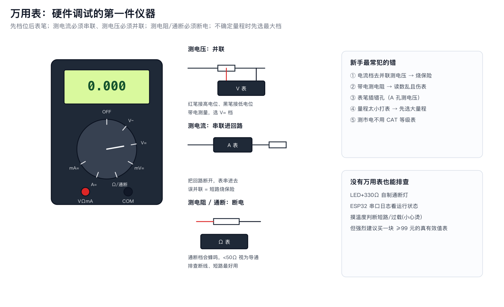

# 01 工具清单与万用表使用

## 1. 必备工具（按优先级）

| 工具 | 预算 | 用途 |
|---|---|---|
| 万用表（真有效值更好） | ¥60~200 | 电压/电流/电阻/通断/二极管 |
| 面包板 + 杜邦线 | ¥30 | 原型搭建 |
| 恒温焊台 | ¥150~400 | 焊接/拆焊 |
| 镊子/斜口钳/剥线钳 | ¥50 | 装配 |
| USB 转 TTL（备用） | ¥15 | 调试串口 |
| 逻辑分析仪 8ch | ¥60~150 | 看 I2C/SPI/UART 波形 |
| 可调电源（限流） | ¥200~500 | 安全上电、测功耗 |
| 放大镜/显微镜 | ¥50~300 | 检查焊点 |

## 2. 万用表四档用法

| 档 | 接法 | 注意 |
|---|---|---|
| V= / V~ | 并联 | 黑笔 COM；先大量程 |
| A= / mA= | **串联** | 误并联=短路烧保险 |
| Ω | 断电并联 | 带电测会错且伤表 |
| 通断(蜂鸣) | 断电 | <50Ω 蜂鸣；排查断线短路神器 |
| 二极管 | 断电 | 显示 Vf；判极性/好坏 |

## 3. 测量技巧

- 测小电流：串 1Ω 电阻测压降换算，避免 µA 档压降影响电路。
- 测纹波：示波器交流耦合 + 20MHz 带宽限制；万用表 AC 档不准。
- 测 ESP32 整机电流：断开 3V3 跳线串入电流表（或用 PP2/PPK2）。
- 通断排查：先测电源对地是否短路，再逐段测连通。

## 4. 安全

- 测市电/强电：本资料不指导实操；如需请专业电工。
- 电容先放电再测电阻。
- 表笔插孔与档位匹配后再上电。
